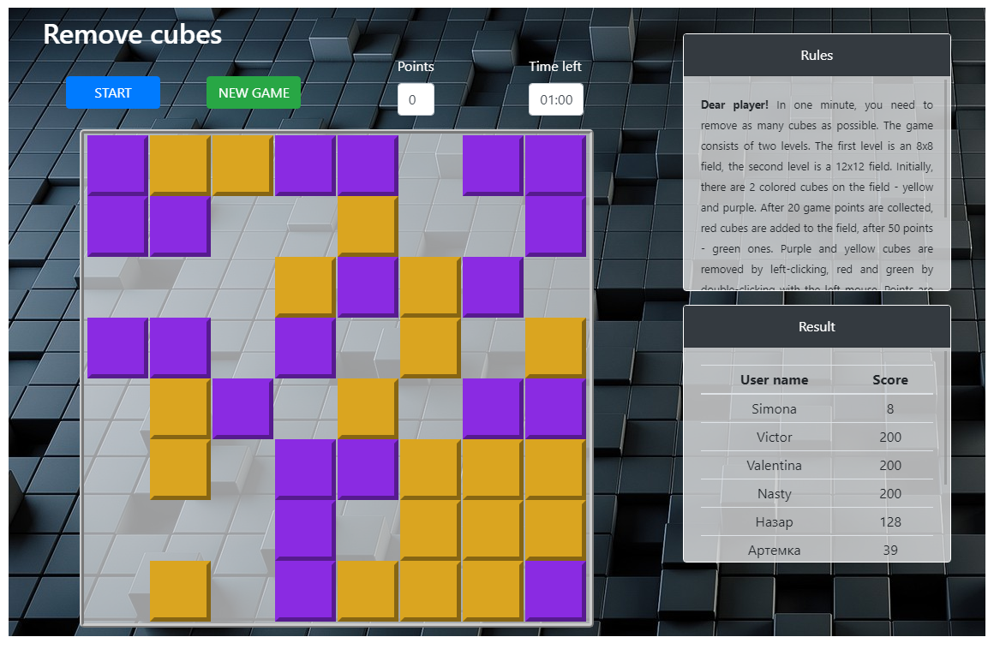
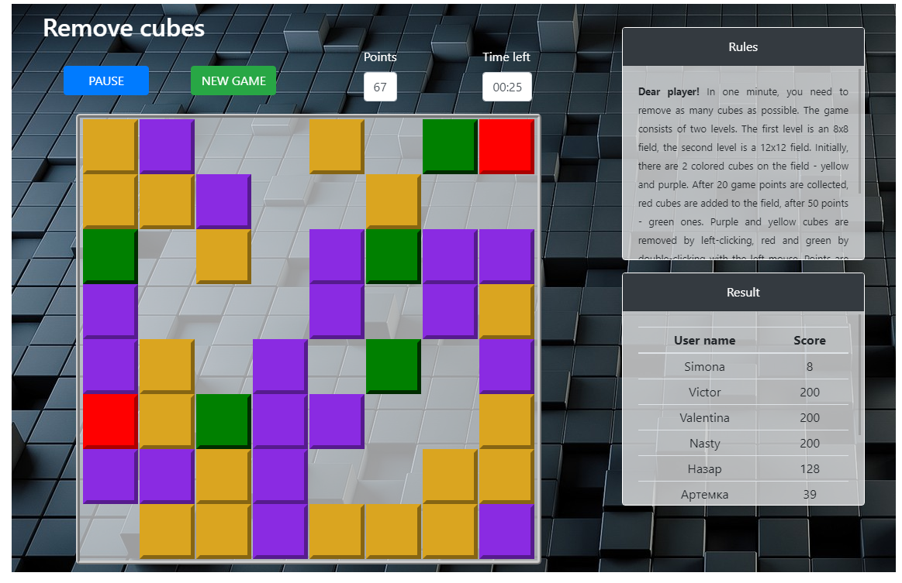
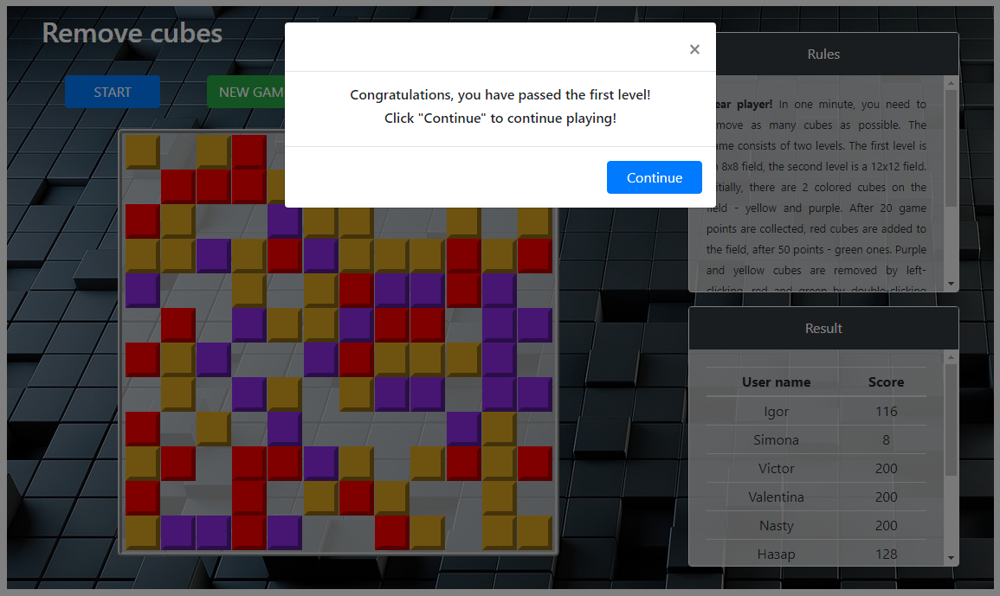
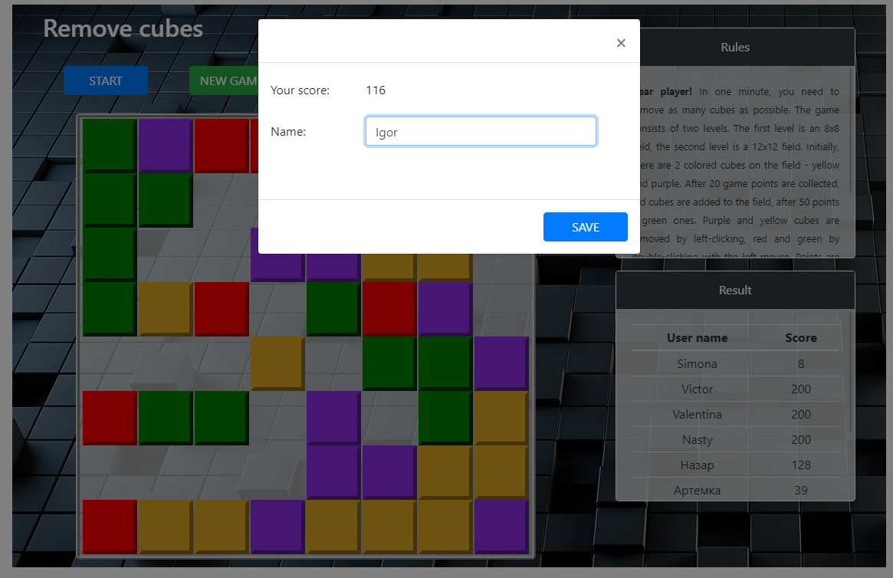
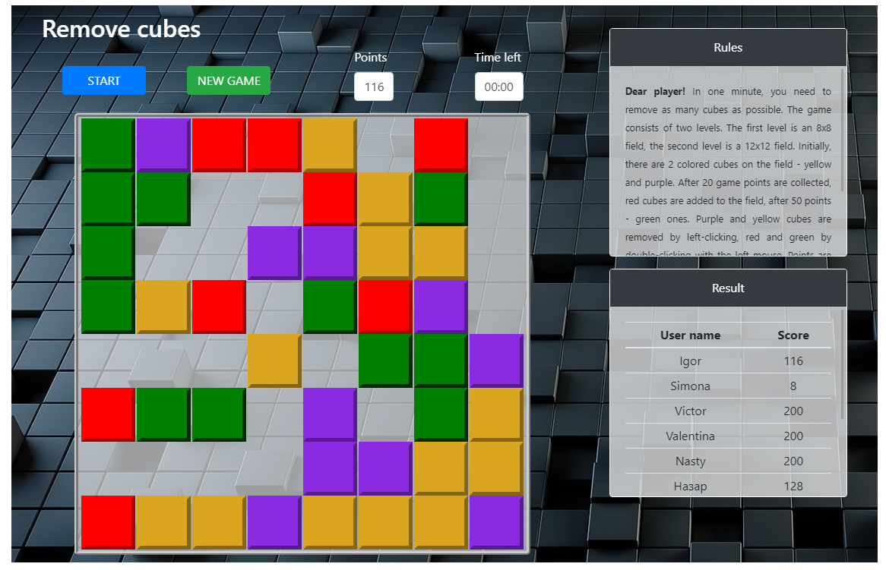

# Remove-cubes
Game "Remove cubes" (JS + Bootstrap)


## Created with
- JS
- Bootstrap


## Clone
- Clone this repo to your local machine using 
``` 
https://github.com/IgorNazaryok/Remove-cubes
```

> ### Rules game
<br>
In one minute, you need to remove as many cubes as possible.
                      The game consists of two levels. The first level is an 8x8 field, the second level is a 12x12 field.
                      Initially, there are 2 colored cubes on the field - yellow and purple. After 20 game points are collected, red cubes are added to the field, after 50 points - green ones.
                      Purple and yellow cubes are removed by left-clicking, red and green by double-clicking with the left mouse.
                      Points are awarded for removing each cube. For a purple cube you get 1 point, a yellow one - 2 points,
                      red - 3 points, green will add one game second to you.

<br><br>

> ### First level game

<br>


 

<br><br>

> ### Second level game

<br>
 


<br>

> ### Save game
 Localstorage is used to store the results.<br><br>



<br>

>### Contact Information
 ***Nazaryok Igor*** <br>
> e-mail: igor.nazarek@gmail.com <br>
Linkedin: http://www.linkedin.com/in/igor-nazaryok
